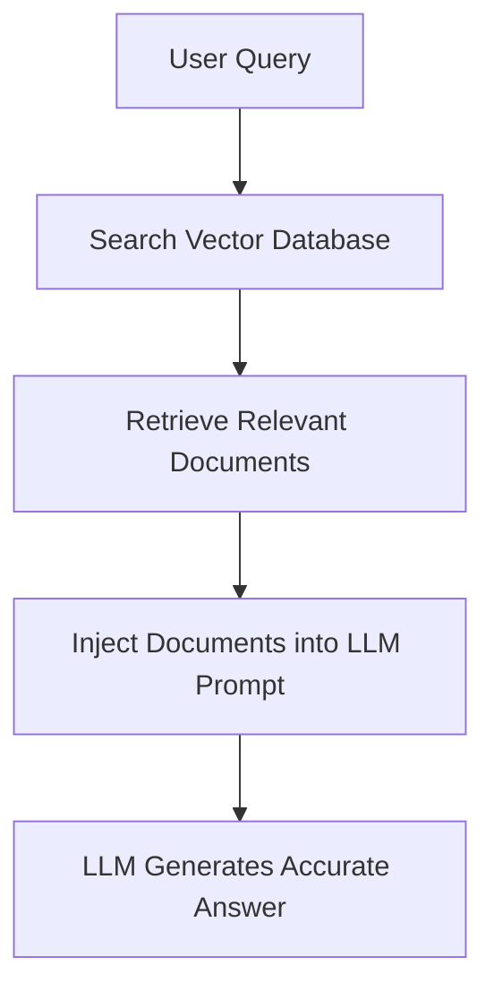

# Foundations & Modern Concepts of Machine Learning

Welcome to the Machine Learning notes directory. This document outlines the fundamental concepts of machine learning, progressing through deep learning, the modern era of transformers/LLMs, and practical agentic workflows.

---

## Part 1: The Foundations of Machine Learning

### 1. Supervised Learning
Supervised learning is teaching a computer by example. You provide the algorithm with a dataset where the "right answers" (labels) are already known. The model learns the relationship between the input data and the output label so it can predict the output for new, unseen data.

> [!NOTE]
> **Analogy:** A teacher showing a student flashcards: *"This is a cat,"* *"This is a dog."* Eventually, the student can identify a cat they've never seen before.
>
> **Examples:** Predicting house prices based on square footage (Regression) or classifying emails as "Spam" or "Not Spam" (Classification).

### 2. Unsupervised Learning
In unsupervised learning, the data has no labels or correct answers. The algorithm's job is to explore the data and find hidden structures, patterns, or groupings on its own.

> [!NOTE]
> **Analogy:** Giving a child a massive box of mixed LEGO blocks and asking them to organize them however makes sense (e.g., by color, size, or shape).
>
> **Examples:** Customer segmentation (grouping buyers with similar habits) or anomaly detection (flagging unusual credit card transactions).

### Comparison: Supervised vs. Unsupervised Learning

| Feature | Supervised Learning | Unsupervised Learning |
| :--- | :--- | :--- |
| **Data** | Labeled (Answers provided) | Unlabeled (No answers provided) |
| **Goal** | Predict outcomes for new data | Discover underlying patterns |
| **Common Uses** | Classification, Regression | Clustering, Association |

---

## Part 2: The Deep Learning Revolution

### 3. Deep Learning
Deep learning is a highly specialized subset of machine learning. It relies on complex structures called neural networks with multiple layers (hence the term "deep"). It excels at handling massive amounts of unstructured data like images, audio, and raw text.

### 4. Neural Networks
Neural networks are the engines powering deep learning, loosely inspired by the biological neurons in the human brain.

* **Structure:** They consist of interconnected nodes arranged in layers:
  * **Input Layer:** Receives data.
  * **Hidden Layers:** Where the processing/math happens.
  * **Output Layer:** The final prediction.
* **Mechanism:** Connections between nodes have "weights." As the network trains, it adjusts these weights to minimize its errors, essentially "learning" the best mathematical path to the correct answer.

### 5. Natural Language Processing (NLP)
NLP is the branch of AI focused on giving computers the ability to understand, interpret, and generate human language. Early NLP relied on strict, human-written rules and dictionaries, but modern NLP relies almost entirely on deep learning. Tasks include language translation, sentiment analysis, and speech recognition.

---

## Part 3: The Modern Era of AI

### 6. Transformers
Introduced by Google in 2017 in the paper *"Attention Is All You Need"*, the Transformer is the architecture that changed AI forever. Before Transformers, models read text sequentially (word by word), making it hard to remember the beginning of a long paragraph.

> [!TIP]
> **The Breakthrough:** Transformers process entire sequences of data at once and use an **Attention Mechanism** to figure out which words in a sentence are most important to each other, regardless of how far apart they are.

### 7. Large Language Models (LLMs)
LLMs (like Gemini, GPT-4, Claude) are massive AI models built on the Transformer architecture. They are trained on virtually the entire public internet. Because of their sheer scale—containing billions or trillions of parameters—they develop advanced reasoning, coding, and conversational capabilities.

### 8. Embeddings
Computers do not understand words; they understand numbers. Embeddings are a way to translate text, images, or audio into long lists of numbers (vectors) that capture their underlying meaning.

> [!NOTE]
> **How it works:** Imagine a massive multi-dimensional map. The embedding for "King" and "Queen" will be placed very close to each other, while "Apple" will be far away. This allows computers to calculate the semantic similarity between concepts.

### 9. Vector Databases
Traditional databases search for exact keyword matches. Vector databases are purpose-built to store, index, and rapidly search through embeddings. Instead of finding exact words, a vector database finds data that means the same thing as your query by calculating the mathematical distance between vectors.

---

## Part 4: Putting Models to Work

### 10. Retrieval-Augmented Generation (RAG)
LLMs have two major flaws: they confidently make things up (hallucinate) and their knowledge is frozen in time at their training cutoff. RAG solves this by giving the LLM a search engine.

#### The Process:
1. A user asks a question.
2. The system searches a Vector Database for relevant, up-to-date, or private company documents.
3. The retrieved information is injected into the LLM's prompt.
4. The LLM generates an accurate answer based strictly on the retrieved data.

### 11. Agents
An Agent is an LLM given autonomy and tools. Instead of just answering a question, an agent can be given a goal, break that goal down into a step-by-step plan, and use tools (like web browsers, calculators, databases, or APIs) to execute the plan.

### 12. LangGraph
LangGraph is a modern programming framework designed to build complex, reliable agent workflows. Standard agents can get stuck in infinite loops or lose track of their goals. LangGraph models agent behaviors as "graphs" (nodes and edges), allowing developers to build stateful, cyclical, and multi-actor AI systems where human-in-the-loop approvals and strict decision routing are possible.

### 13. Agentic RAG
Standard RAG is a straight line: `User asks -> System retrieves -> LLM answers`. Agentic RAG turns this into a dynamic, thinking process.

> [!IMPORTANT]
> **How it differs:** An Agentic RAG system can look at a user's prompt and decide which databases to search, write its own optimized search queries, evaluate the retrieved data to see if it actually answers the question, and if not, decide to search again or use a different tool entirely before finally delivering an answer to the user.
